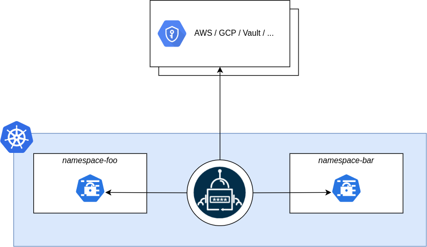

# EXTERNAL SECRETS OPERATOR
### Securing Secrets in Kubernetes with External Secrets Operator




As Kubernetes adoption grows, so does the need for robust secret management. Storing sensitive data like API keys, passwords, and certificates directly in Kubernetes resources can lead to security risks.

That's where External Secrets Operator (ESO) comes in! ESO is a Kubernetes operator that enables secure storage and management of secrets outside of your Kubernetes cluster.

**How it works**
1. Store your secrets in an external secrets store (e.g., AWS Secrets Manager, Google Cloud Secret Manager, HashiCorp Vault).
2. Define a Kubernetes Secret resource that references the external secret.
3. ESO fetches the secret from the external store and injects it into your Kubernetes pods.


**Benefits:**
- **Improved security:** Secrets are stored outside of Kubernetes, reducing the attack surface.
- **Centralized management:** Manage secrets across multiple clusters from a single external store.
- **Simplified rotation:** Rotate secrets without updating Kubernetes resources.


**Steps to Deploy the demo**

For now we are using gcp secret manager to storage and access our secrets
- **Step1:** create a secret in google cloud
```bash
gcloud auth login 
echo "enter your project id"
read PROJECT_ID
gcloud config set project  $PROJECT_ID
gcloud services enable secretmanager.googleapis.com
gcloud secrets create FRONTEND_SECRET --data-file secret.json 

```
- **Step2:**  Create a  demo gke cluster 
```bash
gcloud container clusters create demo-eso --zone asia-south2-a \
--num-nodes  1 \
--machine-type e2-standard-4 \
--workload-pool $PROJECT_ID.svc.id.goog 
```
- **Step3:** Install external secrets operator in our cluster 

```bash
helm repo add external-secrets https://charts.external-secrets.io

helm install external-secrets \
   external-secrets/external-secrets \
    -n external-secrets \
    --create-namespace \
  
```
- **Step4:** Enable Workload-Identity to authenticate external-secrets to secret manager
```bash
gcloud iam service-accounts create  secret-accessor

export SERVICE_ACCOUNT_EMAIL="secret-accessor@${PROJECT_ID}.iam.gserviceaccount.com"

gcloud iam service-accounts add-iam-policy-binding $SERVICE_ACCOUNT_EMAIL  \
--member "serviceAccount:${PROJECT_ID}.svc.id.goog[frontend/gcpsm-accessor]" \
--role roles/iam.workloadIdentityUser

gcloud secrets add-iam-policy-binding FRONTEND_SECRET  \
--member "serviceAccount:${SERVICE_ACCOUNT_EMAIL}" \
--role roles/secretmanager.secretAccessor

sed -i "s/GCP_SERVICE_ACCOUNT/${SERVICE_ACCOUNT_EMAIL}/g" service-account.yaml

```


- **Step5:** deploy the files 

```bash
kubectl apply -f k8s-templates/namespace.yaml
kubectl apply -f k8s-templates/service-account.yaml
kubectl apply -f k8s-templates/secret-store.yaml
kubectl apply -f k8s-templates/external-secret.yaml
kubectl apply -f k8s-templates/deployment.yaml 
kubectl apply -f k8s-templates/service.yaml 

```

**Deployment is complete, inorder to verify the secrets are acessed or not  check the service ip and browse through the website**


 